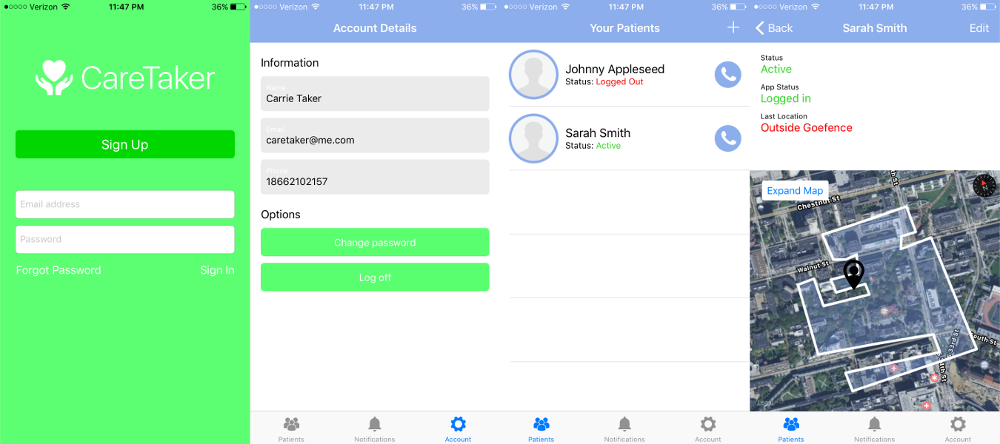

# CareTaker
One of the largest risks for an elderly patient is falling. This app is a simple solution for caretaker's of the elderly to help prevent fatal results if such an accident occurs. Through location tracking, geofencing, and accelerometer analysis, this app is able to alert caretakers when their patients are in danger.

### Screenshots
